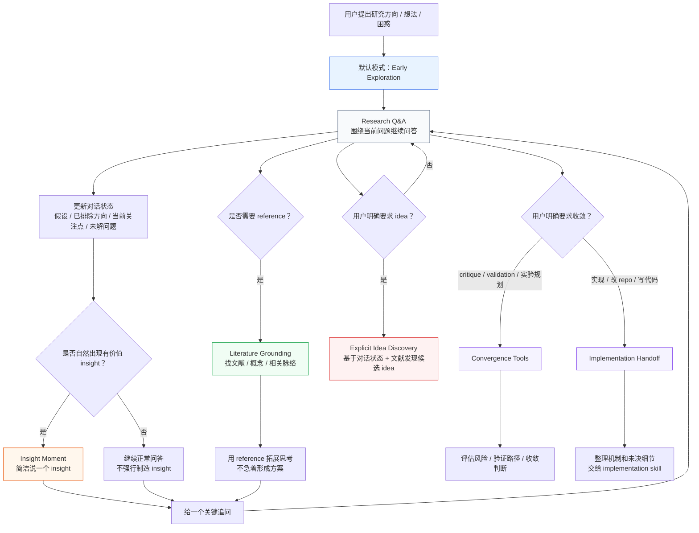

# Personal Brainstorm Skills for Codex

这个仓库现在只暴露一个公开 skill：

- `brainstorm-research-ideas`

它面向 early-stage research discussion，不绑定任何具体研究方向。

目标很明确：

- 以问答形式陪你思考研究方向
- 在讨论中不断提供 insight、reference、反问和重新 framing
- 默认不急着给最终方案、方法、实验设计或 idea list
- 只有当你明确要求时，才进入 idea discovery、critique、validation 或 implementation handoff

## Public Skill

### `brainstorm-research-ideas`

这个 skill 把研究讨论拆成几个内部模式：

1. early exploration：默认模式，只帮助你思考，不急着收敛
2. research Q&A：围绕你当前的问题继续问答
3. insight moment：如果模型真的想到一个有价值的 insight，就简洁说出来
4. literature grounding：需要时检索和整理文献，让 reference 帮助思考
5. explicit idea discovery：只有你明确问“有什么 idea”时，才基于对话和文献发现候选 idea
6. convergence tools：只有你明确要求收敛、评估、实验规划或实现准备时才使用

它适合的任务包括：

- 和 Codex 长期讨论一个研究方向
- 在早期想法还不成熟时，让 Codex 不断追问和启发
- 让 Codex 帮你找相关文献、相关概念或可参考的研究脉络
- 在多轮讨论后，明确要求它基于上下文 discover ideas
- 在你准备收敛时，让它做 critique、validation planning 或 implementation handoff

它不做的事情：

- 在早期讨论里直接给最终方案
- 主动输出一串候选 idea
- 在没有要求时设计方法、模块、loss、pipeline 或实验
- 把每轮对话都包装成 paper plan
- 用看似完整的方案替代真正的研究思考

## Workflow

这个 skill 的核心逻辑是：默认陪你思考，只有你明确要求时才进入 idea discovery、收敛、实验规划或实现 handoff。



## Behavior Guarantee

这个 skill 明确要求：

- 默认采用 question-answer rhythm
- 每轮围绕你当前这句话展开
- 优先给 insight、reference、reframing 和一个高价值问题
- 没有真正 insight 时，不强行制造 insight
- 不用 idea list 填补对话空白
- 不在 early exploration 阶段输出 `方案`、`方法`、`实验设计`、`best bet`、`baseline`、`ablation`

下面这条是硬约束，不是建议：

如果你没有明确要求“给我几个 idea / 帮我 brainstorm / 收敛成方案 / 设计实验”，Codex 不应该主动跳到这些输出。

典型 early exploration 的回答应该更像：

```text
我先不急着给方案。
这里我觉得更值得想的是 ...
这个点让我联想到 ...
我想追问的是 ...
```

## Install

Codex 的个人 skills 默认放在：

```bash
~/.codex/skills
```

### Conversational Install via Codex

如果目标机器上的 Codex 带有系统 skill `$skill-installer`，直接说：

```text
Use $skill-installer to install brainstorm-research-ideas from linchengxing/codex-personal-brainstorm-skills.
```

安装完成后，建议重启 Codex，让新 skill 被重新发现。

### Copy Into Codex

如果你是手动同步，在仓库根目录执行：

```bash
mkdir -p ~/.codex/skills

rsync -a \
  brainstorm-research-ideas \
  ~/.codex/skills/
```

### Direct Installer Script

如果你想手动调用系统安装脚本：

```bash
python3 ~/.codex/skills/.system/skill-installer/scripts/install-skill-from-github.py \
  --repo linchengxing/codex-personal-brainstorm-skills \
  --path brainstorm-research-ideas
```

## Update

### Option 1: Reinstall via `skill-installer`

```text
Use $skill-installer to install brainstorm-research-ideas from linchengxing/codex-personal-brainstorm-skills.
```

### Option 2: Pull and Sync

```bash
git pull

rsync -a \
  brainstorm-research-ideas \
  ~/.codex/skills/
```

## How To Use

最稳妥的方式是显式调用：

```text
Use $brainstorm-research-ideas as an early-stage research Q&A partner. 我现在在想一个研究方向，但还不想要最终方案。请先和我讨论，给 insight、reference 和关键追问。
```

如果你只想继续思考，不想要 idea list，可以这样说：

```text
Use $brainstorm-research-ideas。先不要给方案，也不要设计实验。围绕我下面这个想法继续问答，帮我发现里面的关键张力和相关文献。
```

如果你已经讨论了一段时间，明确想让它发现 idea，可以这样说：

```text
Use $brainstorm-research-ideas。基于我们前面的讨论和你能找到的相关文献，现在帮我 discover 2-4 个候选 idea。
```

如果你想进入收敛阶段，可以这样说：

```text
Use $brainstorm-research-ideas。现在我们可以收敛了，请帮我 critique 当前方向，并指出最需要验证的风险。
```

## Install-Facing Layout

对安装真正重要的是下面这部分：

```text
README.md
brainstorm-research-ideas/
```

其中：

- `brainstorm-research-ideas/SKILL.md` 是核心行为定义
- `brainstorm-research-ideas/agents/openai.yaml` 是 Codex metadata
- `brainstorm-research-ideas/references/idea-discussion.md` 是早期研究问答和 insight 规则
- `brainstorm-research-ideas/references/literature-search.md` 是文献检索和 reference grounding 规则
- `brainstorm-research-ideas/references/convergence-tools.md` 是显式收敛后才使用的 critique / validation 工具

## Local Source Note

如果你在本机开发和测试，这个 skill 的安装目标仍然是：

```bash
~/.codex/skills
```
